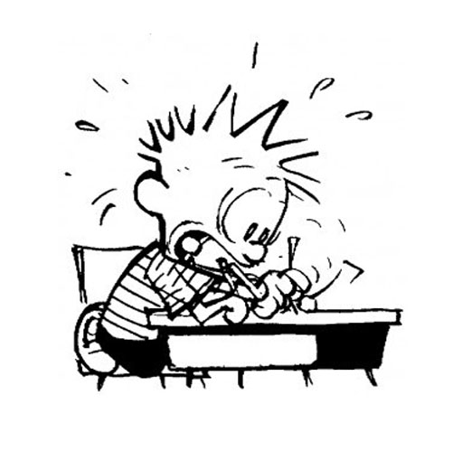

### Motivation
Sometimes the hardest part about testing isn’t the material we study, but the act of taking a test itself.  According to the American Test Anxieties Association, approximately 20% of students suffer from severe test anxiety, while another 16% have moderate test anxiety.  Some estimates have found that this adds up to nearly ten million children whose academic aptitude is not accurately reflected by their grades.  Many students with test anxiety want to improve and are continually frustrated by their poor performance.  For example, youngest sister, who has test anxiety, has heard repeatedly that she should just start studying the material earlier.  I’ve helped her work through the process of the hardest word problems, and then watched her disappointment when she discovers that she tripped up on simple matching questions where she second-guessed herself.

I’ve often wondered if what my sister really needed to study was how to take a test.  But how can we test testing while separating it from testing learned material, and how can we do this in the context of test anxiety?  Perhaps a form of gentle exposure therapy can help anxious students become desensitized to the pressure of the clock and the competition that can be generated by the education system.

### Proposal
What I propose here is a website program that helps motivated but test-anxious students practice their test-taking skills.  The aim is to familiarize students with different test formats, help them grow more comfortable with being on the clock, and allow them to watch their skills improve as they practice.  Here they can practice all sorts of test question types, from true and false to essay questions.  When students make an account, they take an unannounced, timed ‘entrance exam’ which evaluates where their test-taking strengths and weaknesses lie.  Subjective questions are graded by staff (or, when technology allows, AI).  The students then can observe which of their test-taking skills are strong, and which ones they need to practice.  Each day, they receive a daily schedule of quick, timed practice exercises that focus on the skills they need and touch up the ones they have.  In order to add variety, these practices may be in subjects ranging from purely academic to popular culture and common knowledge.  One possible feature to gently simulate the pressure of a real testing environment might be daily leaderboards and some reward for ranking for the different practice exercises. 

### Sources and Inspiration
2018-02-08’s in-class brainstorming session

[Calvin and Hobbes image source](https://legalscholarsite.com/dont-let-grades-define-you/calvin-hobbes-test-anxiety-290x300/)

[Is It Serious](https://amtaa.org/is-it-serious/)
