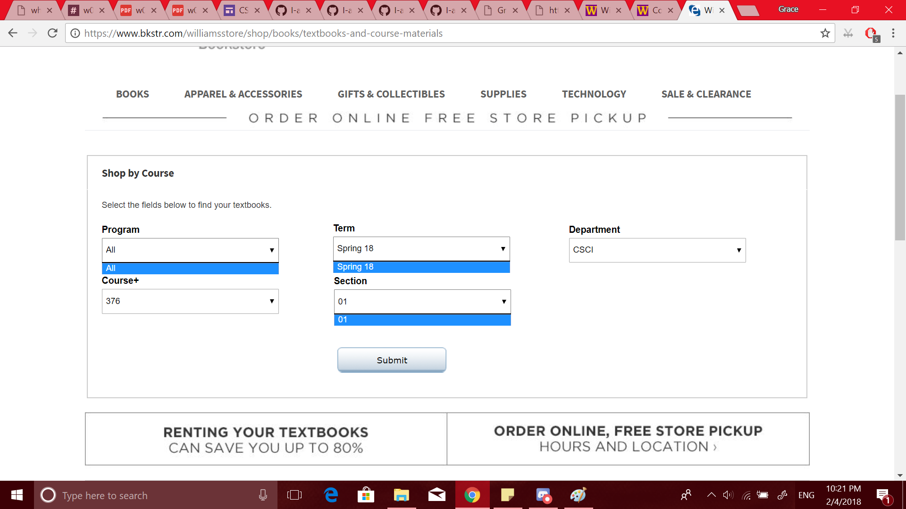

To me, the Williams College Bookstore website looks aesthetically acceptable. The drop-down menus are functional and completely reasonable. And yet... wait. What's the point of a drop-down menu if the only selectable option is the default option?

There's only one option under "Program",  the default option "all", and the same is true for both "Term" and "Section". Now, I know that it's possible for "Term" and "Section" to have more than one option, and that it makes sense to program them both as drop menus because of this. However, I've never seen "Program" have more than the default option (maybe there is, I don't know), so why is it even there? It doesn't add anything - it doesn't even trigger the appearance of "Term" like "Term" triggers the appearance of "Department" if it has more than one selection, since both appear by default. To me, in my possibly uninformed state, a functionless drop menu doesn't need to exist.
