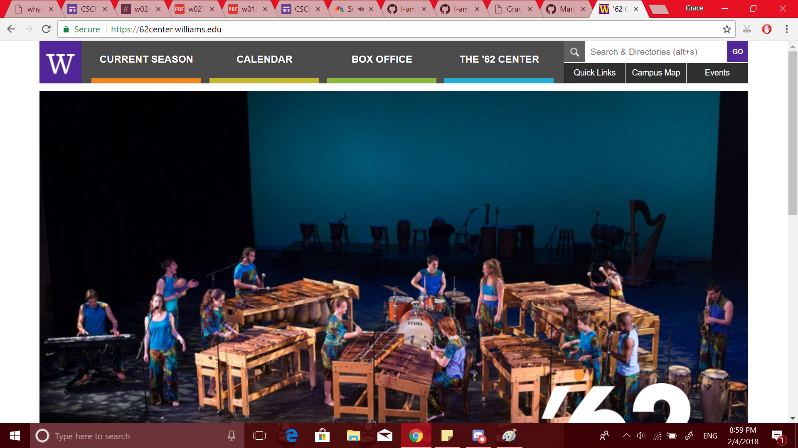
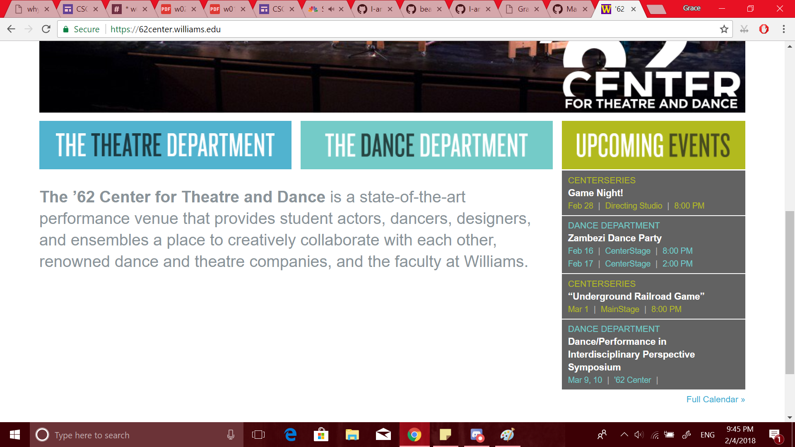

I think that the website for '62 Center for Theatre and Dance is an example of good design. Upon entering, the user is presented with four clearly and distinctly labeled buttons that address the typical needs of someone who is interested in the current happenings of the '62 Center. 

If the user is not interested in investigating the current season of events and/or buying tickets, they can scroll down to see two labeled buttons for each the Theatre Department and the Dance Department that will lead them to more information on each, a brief description of the Center itself, and a list of links to information about upcoming events.

I think these features meet the average user's needs while both looking clean and without clutter.
